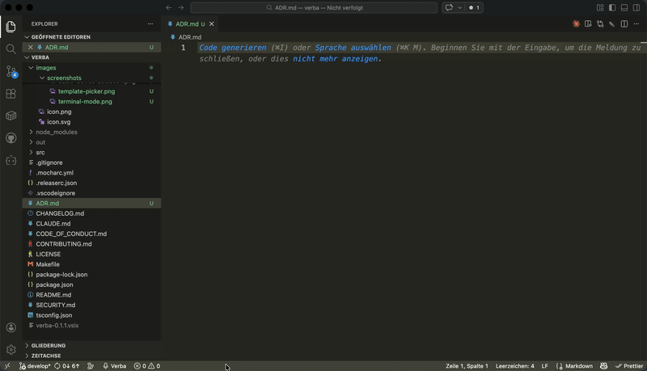
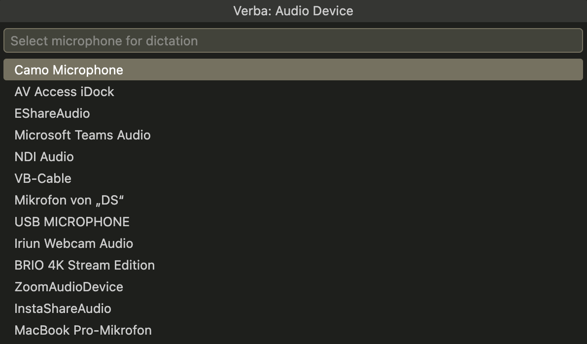
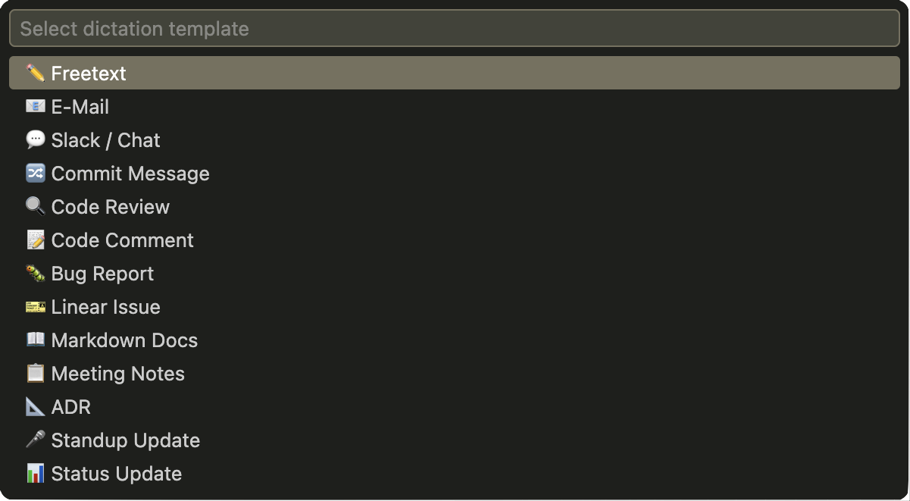
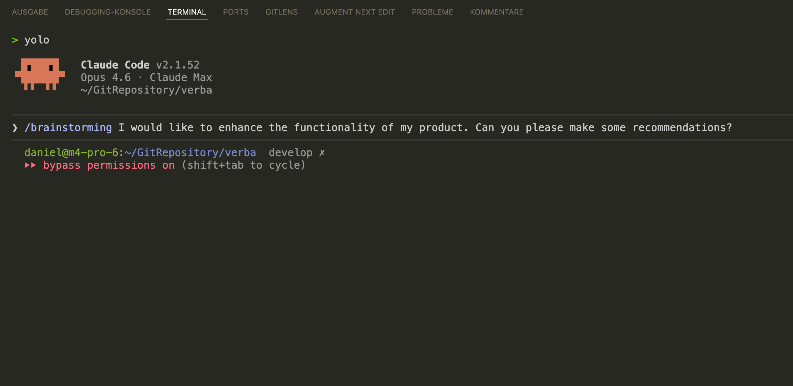

<h1 align="center">Verba</h1>

<p align="center">
  <strong>The Developer's Dictation Extension</strong><br>
  Voice dictation with AI-powered post-processing for VS Code.
</p>

<p align="center">
  <a href="https://marketplace.visualstudio.com/items?itemName=talent-factory.verba"></a>
  <a href="https://marketplace.visualstudio.com/items?itemName=talent-factory.verba"></a>
  <a href="https://opensource.org/licenses/MIT"></a>
  <a href="https://github.com/talent-factory/verba"></a>
</p>

<p align="center">
  Verba records speech via your microphone, transcribes it with OpenAI Whisper, and post-processes the transcript with Claude — all directly inside VS Code. Filler words are removed, sentences are smoothed, and the result is inserted at your cursor position.
</p>

---

## Features

<p align="center">
  
</p>

- **Dictation in Editor and Terminal** -- `Cmd+Shift+D` (Mac) / `Ctrl+Shift+D` (Windows/Linux) starts and stops recording. Text is inserted contextually in the editor or terminal.
- **Streaming Post-Processing** -- Claude processes your transcript in real-time with a live character counter in the status bar. Cancel anytime by pressing the dictation shortcut again.
- **Course Correction** -- Self-corrections in speech are automatically detected and removed. Say "let's meet tomorrow, no wait, on Friday at ten" and only "let's meet on Friday at ten" is kept. Works in all modes.
- **Voice Commands** -- Speak formatting commands like "new paragraph", "comma", "bullet point" and they are converted to actual formatting. Works in any language.
- **Glossary/Dictionary** -- Define terms that must be preserved exactly during transcription and cleanup (e.g. "Visual Studio Code", "Kubernetes"). Global terms in settings, project-specific terms in `.verba-glossary.json`.
- **Prompt Templates** -- Choose a template on first use; it is automatically reused for subsequent recordings. Switch anytime with `Cmd+Alt+T`. 8 built-in templates: Freitext, Commit Message, JavaDoc, Markdown, E-Mail, and 3 context-aware templates (Code Comment, Explain Code, Claude Code Prompt). The template controls how Claude post-processes the transcript.
- **Fully Configurable** -- Templates are defined in `settings.json` and freely extensible. Add custom templates with any prompt.
- **Bring Your Own Key** -- Use your own OpenAI and Anthropic API keys. No subscription costs, full data control. Keys are stored securely in VS Code's SecretStorage.

## Prerequisites

- [ffmpeg](https://ffmpeg.org/) must be installed (audio recording)
- OpenAI API Key (Whisper transcription)
- Anthropic API Key (Claude post-processing)

### Installing ffmpeg

**macOS:**
```bash
brew install ffmpeg
```

**Linux (Debian/Ubuntu):**
```bash
sudo apt install ffmpeg
```

**Linux (Fedora):**
```bash
sudo dnf install ffmpeg
```

**Windows:**

Download from [ffmpeg.org](https://ffmpeg.org/download.html) and add to PATH, or via [Chocolatey](https://chocolatey.org/):
```powershell
choco install ffmpeg
```

### Platform-Specific Notes

| Platform | Audio Backend | Microphone Selection |
|----------|--------------|---------------------|
| macOS | AVFoundation | Configurable via `verba.audioDevice` or Quick Pick |
| Linux | PulseAudio | Configurable via `verba.audioDevice` or Quick Pick |
| Windows | DirectShow | Configurable via `verba.audioDevice` or Quick Pick |

On all platforms, you can select the microphone anytime with the command `Verba: Select Audio Device` or by setting `verba.audioDevice` in Settings. Without configuration, the system default microphone is used.

**Linux:** PulseAudio must be running (default on Ubuntu, Fedora, and most desktop distributions).

**Windows:** On first use, a Quick Pick dialog lets you select the microphone. Verba detects devices via ffmpeg (v7 and v8+ formats) with a PowerShell fallback.

<p align="center">
  
</p>

## Installation

Install from the [VS Code Marketplace](https://marketplace.visualstudio.com/items?itemName=talent-factory.verba):

```
ext install talent-factory.verba
```

Or search for "Verba" in the VS Code Extensions sidebar.

## Quick Start

1. `Cmd+Shift+D` -- on first use, a Quick Pick with template selection appears

<p align="center">
  
</p>

2. Choose a template (e.g., "Free Text") -- recording starts
3. Speak
4. `Cmd+Shift+D` -- recording stops, text is transcribed and processed
5. Result appears at your cursor position

From now on, your last template is reused automatically -- just press `Cmd+Shift+D` to start recording immediately. To switch templates, press `Cmd+Alt+T` (Mac) / `Ctrl+Alt+T` (Windows/Linux) or use the command `Verba: Select Template`. The status bar shows the active template.

On first use, you will be prompted for your API keys, which are stored securely.

### Terminal Mode

When the integrated terminal is focused, dictated text is inserted there instead. With `verba.terminal.executeCommand: true`, the text is additionally submitted with Enter.

<p align="center">
  
</p>

### Claude Code Integration

Use the **Claude Code Prompt** template to dictate tasks for Claude Code. Verba transcribes your voice, enriches it with codebase context, and generates an optimized prompt — ready to confirm in your terminal.

**Setup:**
1. Select the "Claude Code Prompt" template (`Cmd+Alt+T`)
2. Set up a context provider for codebase-aware prompts:
   - **Option A (recommended):** Install [grepai](https://yoanbernabeu.github.io/grepai/) and run `grepai init` in your project
   - **Option B:** Run command `Verba: Index Project` to build the OpenAI Embeddings index
3. Ensure `verba.terminal.executeCommand` is `false` (default) — text is pasted without submitting

**Workflow:**

```
1. Focus your terminal running Claude Code
2. Cmd+Shift+D → recording starts
3. Speak your task naturally, e.g.:
   "I want the pipeline to support streaming so that transcribed
    text appears incrementally during post-processing"
4. Cmd+Shift+D → recording stops
5. Verba:
   a) Transcribes via Whisper
   b) Searches codebase context (pipeline.ts, cleanupService.ts, ...)
   c) Claude generates an optimized prompt:

      "Implement streaming support in the processing pipeline.
       Modify CleanupService.process() in src/cleanupService.ts
       to use Claude's streaming API. Add a callback parameter
       so that insertText.ts can display text incrementally
       as chunks arrive from the API."

6. Prompt appears in your terminal — review, edit if needed, press Enter
7. Claude Code executes the task
```

The template references files and symbols from your codebase via semantic search (grepai or OpenAI Embeddings). The specificity of the generated prompt depends on the context provider's search results -- for best results, mention the area of code you want to modify.

## Configuration

### Custom Templates

Define custom templates in `settings.json`:

```json
{
  "verba.templates": [
    {
      "name": "Free Text",
      "prompt": "Clean up the transcript: remove filler words, smooth broken sentence starts, fix transcription errors. Keep the original language and meaning. Return only the cleaned text."
    },
    {
      "name": "Code Review",
      "prompt": "Convert this transcript into structured code review feedback with bullet points for issues found and suggestions. Keep the original language.",
      "contextAware": true
    }
  ]
}
```

Each template consists of `name` (displayed in Quick Pick), `prompt` (instruction sent to Claude for post-processing), and optionally `contextAware` (if `true`, enables semantic code search and includes relevant code snippets as context for Claude).

### Settings

| Setting | Type | Default | Description |
|---------|------|---------|-------------|
| `verba.audioDevice` | String | `""` | Audio input device name. Leave empty for system default. |
| `verba.templates` | Array | 8 built-in templates | Prompt templates for post-processing |
| `verba.terminal.executeCommand` | Boolean | `false` | Submit text in terminal with Enter |
| `verba.contextSearch.provider` | String | `"auto"` | Context search provider: `auto` uses grepai if available, otherwise OpenAI Embeddings |
| `verba.glossary` | Array | `[]` | Terms preserved during transcription and cleanup (limit: ~80 terms) |
| `verba.contextSearch.maxResults` | Number | `5` | Number of context snippets per dictation (1--20) |

## Architecture

```
Microphone --> ffmpeg (WAV) --> Whisper API --> Claude API --> Editor/Terminal
                                                (Template)
```

| Module | Purpose |
|--------|---------|
| `recorder.ts` | ffmpeg child process for audio recording |
| `transcriptionService.ts` | OpenAI Whisper API integration (glossary hints) |
| `cleanupService.ts` | Anthropic Claude API integration (streaming, course correction, voice commands, glossary) |
| `pipeline.ts` | Processing stage orchestration |
| `templatePicker.ts` | Quick Pick menu for template selection |
| `insertText.ts` | Text insertion into editor or terminal |
| `statusBarManager.ts` | Status bar display (Idle/Recording/Transcribing) |

## Development

```bash
npm run compile     # Compile TypeScript
npm run watch       # Watch mode
npm run test:unit   # Unit tests
npm run test        # All tests (compile + unit + integration)
```

## Contributing

Found a bug or have a feature request? [Open an issue](https://github.com/talent-factory/verba/issues).

## License

[MIT](LICENSE)
