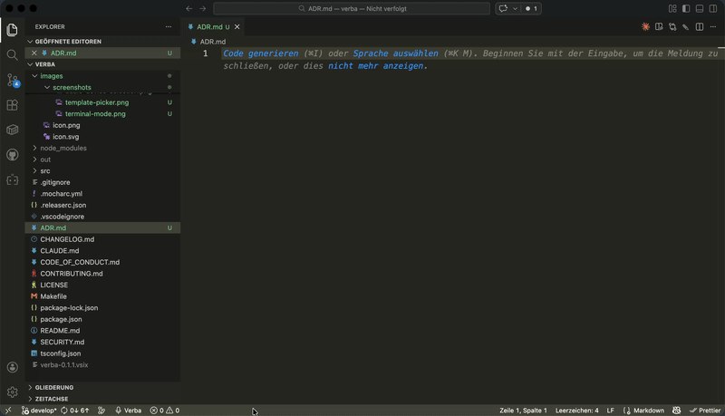
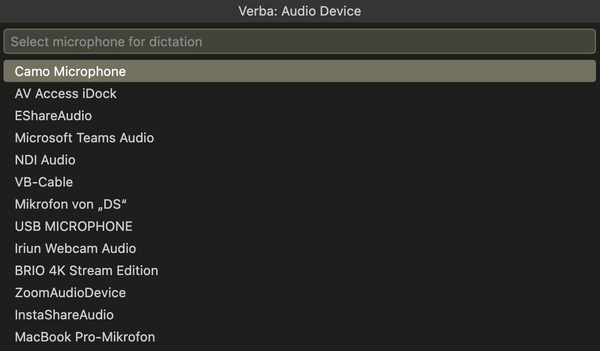

<h1 align="center">Verba</h1>

<p align="center">
  <strong>Verba — developer-grade voice dictation, everywhere you type.</strong>
</p>

<p align="center">
  <a href="https://marketplace.visualstudio.com/items?itemName=talent-factory.verba"></a>
  <a href="https://marketplace.visualstudio.com/items?itemName=talent-factory.verba"></a>
  <a href="https://opensource.org/licenses/MIT"></a>
  <a href="https://github.com/talent-factory/verba"></a>
  
</p>

<p align="center">
  Speak instead of type. Verba records your voice, transcribes it with <strong>Deepgram Nova-3</strong>, and refines it with <strong>Claude</strong> — <strong>system-wide across macOS (Beta)</strong> or <strong>deep inside VS Code</strong>. Bring your own keys, keep your data.
</p>

---

## Why Verba

- **Bring Your Own Key** -- your own Deepgram + Anthropic keys; no subscription.
- **Privacy & data control** -- keys in the OS keystore; optional fully offline transcription (whisper.cpp); your audio and text are never routed through us.
- **Developer- & code-aware** -- code-aware templates, Claude Code prompt generation, commit messages, JavaDoc, and deep VS Code integration.
- **Everywhere** -- the same dictation intelligence in your editor *and* across your whole Mac.

## Two ways to use Verba

### VS Code Extension

*Dictate into your editor and terminal, with code-aware AI templates.*

The shipped flagship, available today on the VS Code Marketplace:

```
ext install talent-factory.verba
```

Or search for "Verba" in the VS Code Extensions sidebar.

Full guide: [VS Code Installation](docs/vscode/installation.md)

### macOS App (Beta)

*System-wide dictation into any app — press a hotkey, speak, and Verba pastes clean text wherever your cursor is.*

**Beta -- build from source.** There is no packaged download yet; run it via `just macos-dev` (or `npm run tauri dev` from `apps/macos`).

<!-- TODO: add macOS menu-bar / HUD screenshot (images/screenshots/macos-hud.png) -->

Full guide: [macOS Installation](docs/macos/installation.md)

## Features

<p align="center">
  
</p>

### Core dictation intelligence (both surfaces)

- **Streaming Post-Processing** -- Claude cleans up your transcript in real time as it streams back.
- **Course Correction** -- self-corrections in speech are detected and removed automatically. Say "let's meet tomorrow, no wait, on Friday at ten" and only "let's meet on Friday at ten" is kept.
- **Voice Commands** -- spoken formatting commands like "new paragraph", "comma", "bullet point" are converted to actual formatting, in any language.
- **Glossary/Dictionary** -- define terms that must be preserved exactly during transcription and cleanup (e.g. "Visual Studio Code", "Kubernetes").
- **Text Expansions** -- user-defined abbreviations are expanded during post-processing.
- **Prompt Templates** -- template-driven post-processing (Free Text, Commit Message, JavaDoc, Markdown, E-Mail, and more), freely configurable with your own prompts.

### VS Code

- **Editor & Terminal Insertion** -- `Cmd+Alt+V` (Mac) / `Ctrl+Alt+V` (Windows/Linux) starts and stops recording; text is inserted contextually in the editor or the integrated terminal.
- **Multi-Cursor / Selection-Aware Dictation** -- dictated text replaces a selection, fills every cursor position, or is passed to Claude as context for the transformation.
- **Dictation History & Full-Text Search** -- every dictation is saved locally and searchable across raw transcript and cleaned text; re-insert or copy past results.
- **Continuous Dictation** -- longer sessions via Deepgram Nova-3 WebSocket streaming with automatic pause segmentation (`Cmd+Shift+Alt+D`).
- **Offline Transcription** -- transcribe fully locally with [whisper.cpp](https://github.com/ggml-org/whisper.cpp): zero API cost, audio never leaves your machine.
- **File-Type-Aware Templates** -- the right template (e.g. JavaDoc for Java/Kotlin) is selected automatically from the active editor's language.

### macOS (Beta)

- **System-wide Global Hotkey** -- `Ctrl+Alt+D` toggles microphone capture from any app.
- **Push-to-Talk (hold to talk)** -- hold **right-Command** to insert, or **right-Option** to insert *and* submit; release to deliver. A short tap never records.
- **Agent-Native Delivery** -- a focused terminal agent pane (e.g. a herdr-managed Claude Code session) gets the cleaned text typed straight in -- no Accessibility permission needed -- while every other app falls back to the clipboard paste. The right template is picked automatically from the focused surface (agent / terminal / editor).
- **Paste into the Frontmost App** -- transcribed, cleaned text is pasted wherever your cursor is; the previous clipboard content is restored afterwards.
- **Menu-Bar Configuration & Template Picker** -- switch transcription provider, cleanup language, and active template straight from the tray menu.
- **HUD Working Visualization** -- a non-activating, click-through pill shows idle/recording/transcribing/processing state.
- **Keychain-Backed Keys** -- Deepgram and Anthropic keys are stored in the macOS Keychain.

## Prerequisites

- [ffmpeg](https://ffmpeg.org/) -- required for the VS Code extension's microphone recording (the macOS app captures audio natively via `cpal` and does not need ffmpeg)
- Deepgram API Key (Nova-3 transcription), shared by both surfaces -- *or* [whisper-cpp](https://github.com/ggml-org/whisper.cpp) for offline transcription (VS Code only, for now)
- Anthropic API Key (Claude post-processing), shared by both surfaces

### Installing ffmpeg

**macOS:**
```bash
brew install ffmpeg
```

**Linux (Debian/Ubuntu):**
```bash
sudo apt install ffmpeg
```

**Linux (Fedora):**
```bash
sudo dnf install ffmpeg
```

**Windows:**

Download from [ffmpeg.org](https://ffmpeg.org/download.html) and add to PATH, or via [Chocolatey](https://chocolatey.org/):
```powershell
choco install ffmpeg
```

### Platform-Specific Notes (VS Code)

| Platform | Audio Backend | Microphone Selection |
|----------|--------------|---------------------|
| macOS | AVFoundation | Configurable via `verba.audioDevice` or Quick Pick |
| Linux | PulseAudio | Configurable via `verba.audioDevice` or Quick Pick |
| Windows | DirectShow | Configurable via `verba.audioDevice` or Quick Pick |

On all platforms, you can select the microphone anytime with the command `Verba: Select Audio Device` or by setting `verba.audioDevice` in Settings. Without configuration, the system default microphone is used.

**Linux:** PulseAudio must be running (default on Ubuntu, Fedora, and most desktop distributions).

**Windows:** On first use, a Quick Pick dialog lets you select the microphone. Verba detects devices via ffmpeg (v7 and v8+ formats) with a PowerShell fallback.

<p align="center">
  
</p>

## Get started

- **VS Code:** press `Cmd+Alt+V` / `Ctrl+Alt+V`, pick a template on first use, speak, then press the shortcut again -- the result appears at your cursor. Full walkthrough: [VS Code Quick Start](docs/vscode/quickstart.md).
- **macOS (Beta):** build from source with `just macos-dev`, then press `Ctrl+Alt+D` anywhere to start dictating -- Verba pastes the cleaned text into the frontmost app. Full walkthrough: [macOS Installation](docs/macos/installation.md).

## Configuration

**VS Code** reads templates, glossary, and expansions from `settings.json`, with project-specific overrides in `.verba-glossary.json` and `.verba-expansions.json` -- see the [VS Code Configuration guide](docs/vscode/configuration.md). **macOS (Beta)** uses a single config file at `~/.config/verba/config.json` (XDG), editable via the tray menu or directly -- see the [macOS Configuration guide](docs/macos/configuration.md).

## Architecture

```
                          @verba/core
        (pipeline · cleanup · Deepgram provider · config schema)
                       /                        \
          VS Code Extension                macOS App (Beta)
          (Electron / Node.js)               (Tauri / Rust)
```

Both hosts wrap the same dictation pipeline (record → transcribe → Claude post-process → insert/paste) around platform-specific adapters. Full breakdown: [Architecture](docs/development/architecture.md).

## Documentation

Full documentation site: [talent-factory.github.io/verba](https://talent-factory.github.io/verba/) -- or browse the [`docs/`](docs) directory directly.

## Contributing

Found a bug or have a feature request? [Open an issue](https://github.com/talent-factory/verba/issues). For local development setup (monorepo layout, build commands), see [Contributing](docs/development/contributing.md).

## License

[MIT](LICENSE)
